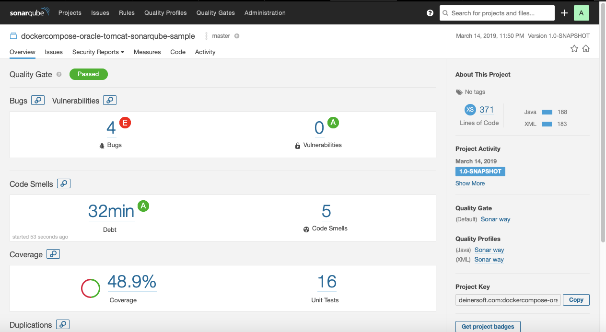

This project demonstrates a way to build and test directly on the desktop command line (and by implication, on CI servers as well) between an Oracle database and a Tomcat application.  Sonarqube is also locally incorporated for static code analysis.


```bash
./build_1_run_unit_tests.sh
```
1. Build the project and run unit tests.

```bash
./build_2_create_integration_test_environment.sh
```
1. Docker-compose containers for Oracle, Tomcat, and Sonarqube to life.
2. Wait appropriately for the containers to start and be ready for operations.
3. Build a liquibase.properties file and invoke Liquibase to create the test database.

```bash
./build_3_run_integration_tests.sh
```
1. Build the Tomcat war to test along with an oracleConfig.properties to configure the app to the database it needs.
2. Deploy those two artifacts to Tomcat.
3. Perform a smoke test against the integrated system.
4. Build the rest_webservice.properties file used by our Cucumber tests. 
5. Run the full integration regression test suite (Cucumber for Java used).
6. Run the Jacoco and Sonarqube analysis 
7. Enjoy the results!


```bash
./build_4_destroy_integration_test_environment.sh
```
1. Docker-compose away the containers we built.
2. Delete the temporary files we created during the run that facilitated the integration of components.
